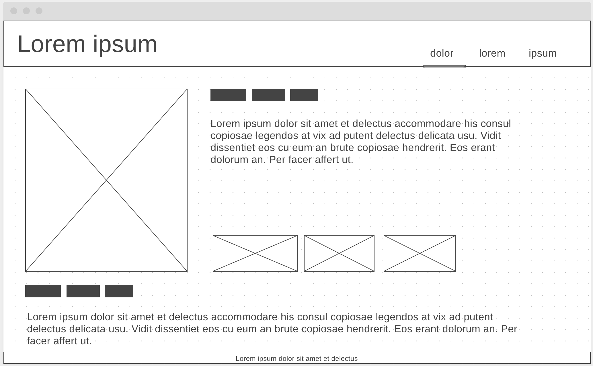

# Hello, Portfolio!

Welcome to the project info for my personal portfolio website!

## Using the site

Direct the browser to [ruthmoog.dev](https://www.ruthmoog.dev)
<!-- or the temp url `https://intense-badlands-89473.herokuapp.com/` -->

### Remind me how to deploy...

send to the GitHub repo:
```shell
$ git push
```

:rocket: Automatic deploys are enabled via Heroku
<!-- send to Heroku and deploy:
```shell
$ heroku login
$ git push heroku master
``` -->

## Technology

 - [CSS3](https://developer.mozilla.org/en-US/docs/Archive/CSS3) - a cascading style sheets language
 - [Heroku](https://www.heroku.com/) - a cloud platform service
 - [HTML5](https://w3.org/html/logo) - an internet document mark-up language


This website is cleaner than 92% of websites tested by [Website Carbon Calculator](https://www.websitecarbon.com/website/ruthmoog-dev/), at 0.08g of CO2 per view.

## References

- "[How to run a html/css/js app on Heroku](https://medium.com/@winnieliang/how-to-run-a-simple-html-css-javascript-application-on-heroku-4e664c541b0b)"
- [Gitmoji](https://gitmoji.carloscuesta.me/), an emoji guide for fun, semantic commit messages

## Wireframes


