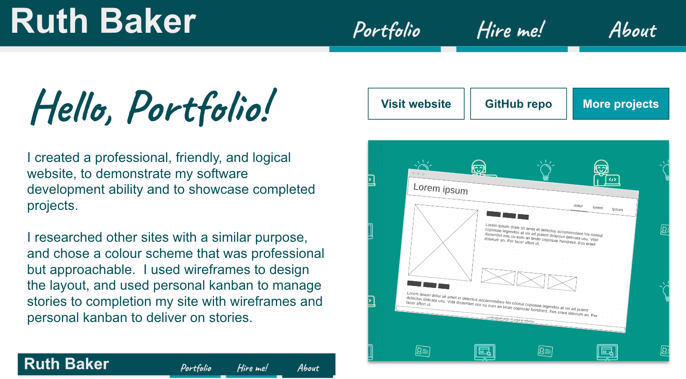

# Hello, Portfolio!

Welcome to the project info for my personal portfolio website!

## Using the site

Direct the browser to [ruthmoog.dev](https://www.ruthmoog.dev)
<!-- or the temp url `https://intense-badlands-89473.herokuapp.com/` -->

## Technology

:rocket: Automatic deploys are enabled via Fly.io through GitHub Actions

 - [CSS3](https://developer.mozilla.org/en-US/docs/Archive/CSS3) - a cascading style sheets language
 - [HTML5](https://w3.org/html/logo) - an internet document mark-up language

## References

- [Website energy efficiency](https://www.wholegraindigital.com/blog/website-energy-efficiency/)

## Previous iterations

I've enjoyed redesigning my website over time, expand to see some examples of previous iterations

[Wayback Machine 10 May 2022](https://web.archive.org/web/20220510042217/http://ruthmoog.dev/)

